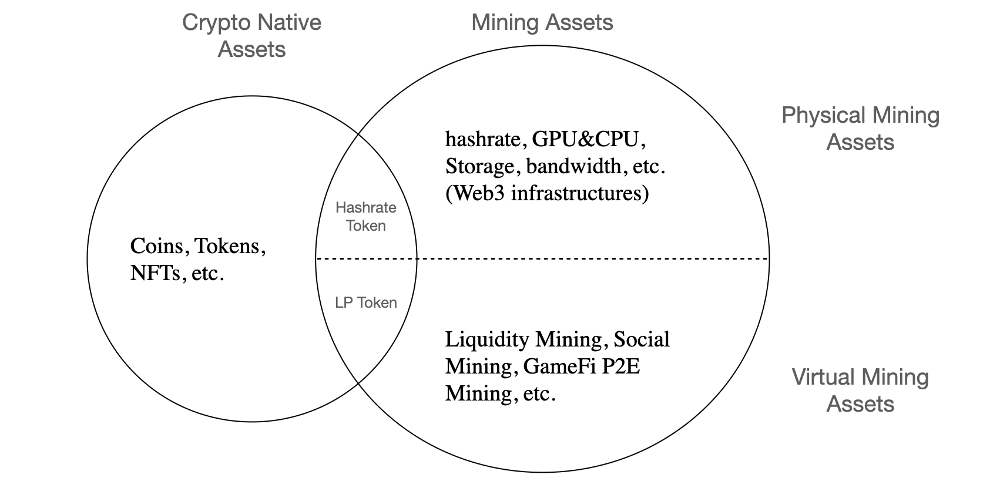

# Background

**Computing power is the most important infrastructure in the crypto industry.**

The computing power resources owned by Bitcoin and Ethereum miners ensure the normal operation of these networks, and support the storage and circulation of trillions of dollars in value. In terms of revenue, the current total annual output value of Ethereum's computing power exceeds US$30 billion, and that of Bitcoin exceeds US$20 billion.

Meanwhile, **with the gradual development of the Web3.0 and Metaverse, the boundaries of "computing power" and "mining" are also expanding**, with more real-world resources being mapped on the blockchain, where DFinity provides general computing resources for Web3.0; Filecoin, Arweave, etc. provide decentralized storage resources for blockchain users; Render Network provides distributed rendering resources for Metaverse; THETA Network allows users to contribute memory and bandwidth resources, etc. . With the advent of the DeFi wave, even concepts like liquidity mining have emerged. "Hashing power" no longer specifically refers to computing resources that are used to calculate various hashrates. All computing, storage, bandwidth resources and liquidity required by Web3.0 and Metaverse are computing power in a broad sense, and all those who provide resources are the ‘miners’ of the future. With the further development of the industry, the scale of computing power resources and computing power assets will usher in an unprecedented scale.

However, except on-chain liquidity, whether it is traditional hashrate mining or the new compound computing power that has just begun to emerge, it seems that most of them are still using traditional business models with low capital efficiency and high trust boundaries that are unable to be incorporated with decentralized finance and next-generation “Internet”. The essential reason is that off-chain computing resources and computing power assets cannot be mapped to smart contracts on the blockchain, thus lacking programmability and composability, leaving no liquidity on-chain. Furthermore, one cannot simply put the computing power assets on the chain through a commitment, it violates the original intention of decentralization. Secondly, the on-chain circulation of computing power cannot really affect the off-chain world. Therefore, although computing power is a high-quality asset in the blockchain industry, it has never been able to circulate in a decentralized world.

So we see that in a typical cryptocurrency ecosystem, many **mining assets** (hereinafter **MA**) , cannot be decentralized verified and are difficult to integrate into the mainstream DeFi ecosystem, and ordinary investors cannot capture the great value of MA by participating in the project. Accordingly, the lack of MA liquidity makes it difficult for MA holders to have convenient and robust financing channels.

**UncleMine hopes to use cryptographic technologies such as zero-knowledge proof to integrate on-chain liquidity and off-chain computing resources, break the barriers of various computing resources off-chain and virtual worlds on blockchains, redefine the form of computing power in the next-generation Internet, establish a smooth financing channel to help MA holders, and open to provide MA liquidity as a new on-chain assets.**
