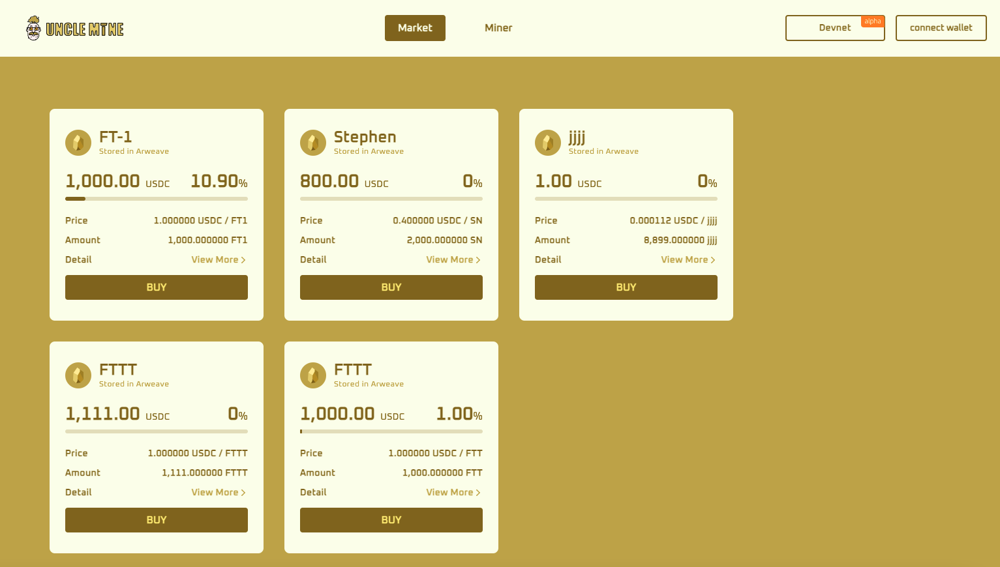

# Market

#### What is Market for?

Market is a place where all users can trade Tokens. Miner users can create their own Tokens on UncleMine and place them on the market for sale. Miners can also buy tokens created by other miners. Non-miner users can only trade Tokens in UncleMine Market. The tokens that were allowed for trading on the UncleMine platform are limited to the tokens created by miner users.

#### How to buy a Token in the Market?

Before any transaction operations on the market page, all kinds of users need to connect to their wallets.

The whole process of buying tokens is quite simple. Choosing the token that you prefer, click “BUY” to select the allowable range of purchase shares. Once the transaction is succeed, you can view the token and transaction information on the Asset page.

Is there a transaction fee? How does the price fluctuate？ Are there any upper and lower limits on the shares that can be purchased?
