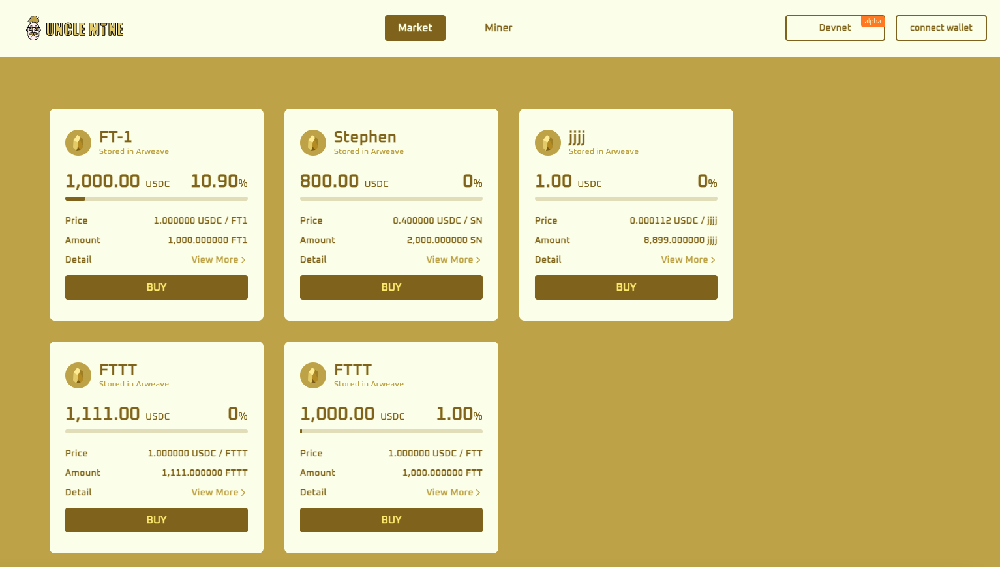
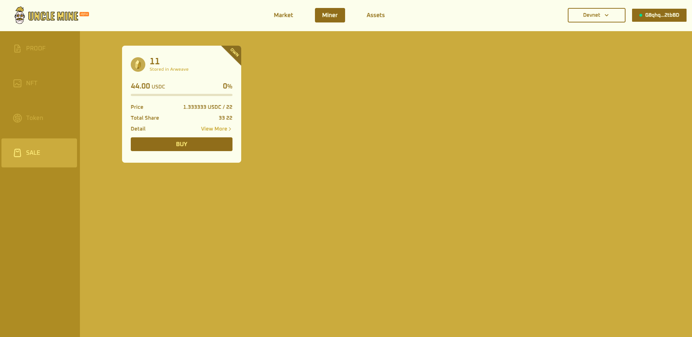

# Miner

#### How to create a Proof?

First of all, you have to be a miner to create a Proof. A Proof is an evidence of a miner’s current effective hash power and it requires miners to continuously update. One miner address can only generate one Proof. **For testing, you can find an MinerID on Filecoin block explorers, such as** [**filfox.io**](https://filfox.io) **or** [**filscan.io**](https://filscan.io)**.** Proof can be used to generate only one NFT. To create a Proof, click “**Create New**” and input miner ID to generate a sign code, use this sign code on Lotus to get a signature then verify it on UncleMine, a proof will be generated once the verification is successful. **For testing, input anything to continue.**

#### How to create an NFT?

To generate an NFT, you must have at least one available proof that was never used to mint any NFT before. Unlike Proof, NFT is tradable.

\
The entire process of creating an NFT is quite simple, just click ‘**Mint**’ on the NFT page and choose one available Proof that was never used to mint any NFT before, click ‘**Confirm**’ and there will have a brand new NFT displaying on the NFT page.

.png>)

#### How to create a brand new Token?

To generate a Token, you must have at least one available NFT that was never used to mint any Token before. Click ‘**Mint**’ and select an available NFT, then give your token a name and symbol, and set a total share amount, click confirm to complete.

.png>)

#### How to publicly sell the token I created?

After creating the Token with NFT, you can choose whether to put it on the market for public sale. The process of move-to sell is quite simple. Just click ‘**Sell**’ and select the total value you want to issue, then you can see the Token you are selling in the market.

